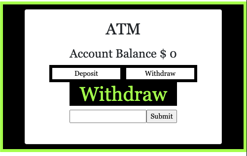

# Simple React ATM

 

# About:

 [Click here to see the Simple React ATM in action.](https://rainakpuels.github.io/Simple-React-ATM)

This is an exercise developed during MIT xPro Full Stack Professional Certificate in Coding.

Using JavaScript,HTML, and CSS I created a simple React ATM application. 

# How to Run

If you want to run it on a browser, just click the above link. Then, click "Deposit" or "Withdraw" and then submit. Watch the "Account Balance" change accordingly! 

If you want to run it locally:

    Download the files.

    Run npm install to install the project dependencies.

    Run npm start to start the development server.

I stylized the ATM so the UI would be easier to understand. Now, the user can clearly see if they are Deopositing or Withdrawing because of the loud green font with a black background that declares their option. 

# Roadmap of Future Improvemenets

One could update this app so it's impossible to withdraw more money than is deposited. You could also print a list of transactions, so the user can see the inflow and outflow of cash. 

# Liscence Information 

[MIT License](https://github.com/rainakpuels/React-To-Do-List/blob/default/LICENSE)
